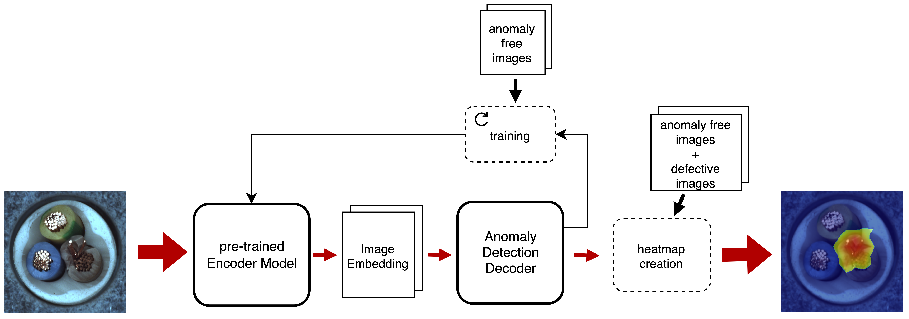

# Evaluating Vision Transformer Models for Visual Quality Control in Industrial Manufacturing

We publish the code relating to our experiments in this repository.

**Abstract:** One of the most promising use-cases for machine learning in industrial manufacturing is the early detection of defective products using a quality control system. Such a system can save costs and reduces human errors due to the monotonous nature of visual inspections.
Today, a rich body of research exists which employs machine learning methods to identify rare defective products in unbalanced visual quality control datasets.
These methods typically rely on two components: A visual backbone to capture the features of the input image and an anomaly detection algorithm that decides if these features are within an expected distribution. With the rise of transformer architecture as visual backbones of choice, there exists now a great variety of different combinations of these two components, ranging all along the trade-off between detection quality and inference time.
Facing this variety, practitioners in the field often have to spend a considerable amount of time on researching the right combination for their use-case at hand. Our contribution is to help practitioners with this choice by reviewing and evaluating current vision transformer models together with anomaly detection methods. For this, we choose SotA models of both disciplines, combine and evaluate them towards the goal of having small, fast and efficient anomaly detection models suitable for industrial manufacturing. We evaluate the results on the well-known MVTecAD and BTAD datasets and propose considerations for using a quality control system in practice.

## Architecture and Training Procedure

We trained several anomaly detection approaches, all following an Encoder-Decoder structure. In our experiments we used five different encoders and three different decoders. The results of four encoders and two decoders are described in more detail in our paper.

The training of the different architectures all followed the following approach:

## Structure of this repository

This repository is structured as follows:

- `csv_results_gmm/`: results for different training runs with the GMM-based architecture
- `csv_results_nf/`: results for different training runs with the NF-based architecture
- `csv_results_recon/`: results for different training runs with the image reconstruction-based architecture
- `data/`: different used datasets. Download the datasets [MVTecAD](https://paperswithcode.com/dataset/mvtecad) and [BTAD](https://paperswithcode.com/dataset/btad) and copy them in this folder. The structure of the datasets has to be like it is when downloading them and can be verified in the training scripts.
- `images/`: images displayed in this readme
- `pretrained_vit_weights/esvit-T/`: Trained weights for the esvit-T model with Swin Transformer T and window size 14. The weights can be downloaded from [this](https://github.com/microsoft/esvit) repository. The used weights are EsViT (Swin-T, W=14).
- `src/`: source code for all models
  - `classes/`: classes for the different model architectures. In the root level, classes for Cnn Models and Detection models are located.
    - `resnet/`: Implementation for pre-trained ResNet and reverse ResNet
    - `transformer/`: Implementation for the different used vision transformer models
  - `data_loader/`: dataloader and dataset class to load different datasets. Generic classes that can cope with both datasets.
  - `pipelne/`: Learner and Validator classes to train and test the different implemented models. One class for each implemented anomaly detection method.
  - `util/`: different helper functions to bundle complexity
- `trained_model_weights/`: weights of the models for different training runs. These weights are used when running the validation script
- `requirements.txt`: listed requirements used within the conda environment
- `startTraining_mdn.py`: script to start trainingsrun for Gaussian Mixture Models
- `startTraining_nf.py`: script to start trainingsrun for Normalizing Flows
- `startTraining_recon.py`: script to start trainingsrun for image reconstructions with a Convolutional Auto Encoder
- `trainings_loop.py`: script to start several training runs in a row. Has to be modified to the desired runs.
- `validation_loop.py`: script to start several validation runs in a row. Has to be modified to the desired runs. Trained weights have to be available and the path specified.

## Model Training

1. Create a python environment with your favorite tool e.g. conda or venv.
1. Install the needed requirements in this environment with `pip install -r requirements.txt`.
1. Train Auto-Encoder, Mixture Density Network or Normalizing Flow models via the respective scripts. Hyperparameter can be set with console arguments. `-h` shows a detailed description of the argument options.
   - **Train AE**: `python startTraining_recon.py -m "enc_deit" -l 1e-3 -w 1e-5 -i 224 -b 32 -n 500 -p 60`
   - **Train MDN**: `python startTraining_mdn.py -m "enc_deit" -l 1e-3 -w 1e-5 -i 224 -b 32 -n 500 -p 60 -n 150`
   - **Train NF**: `python startTraining_nf.py -m "enc_deit" -l 1e-3 -w 1e-5 -i 224 -b 32 -n 500 -p 60`
1. Results are automatically pushed to weights & biases. You need to login via console to grant access.

## Code formatting

Code formatting is done according to PEP8 conventions. Pylint and Black are used to enforce formatting. More details can be found [here](https://books.agiliq.com/projects/essential-python-tools/en/latest/linters.html). Settings for code formatting can be found in [settings.json](../.vscode/settings.json) for VSCode. Pylint rules are defined in [.pylintrc](../.pylintrc)
